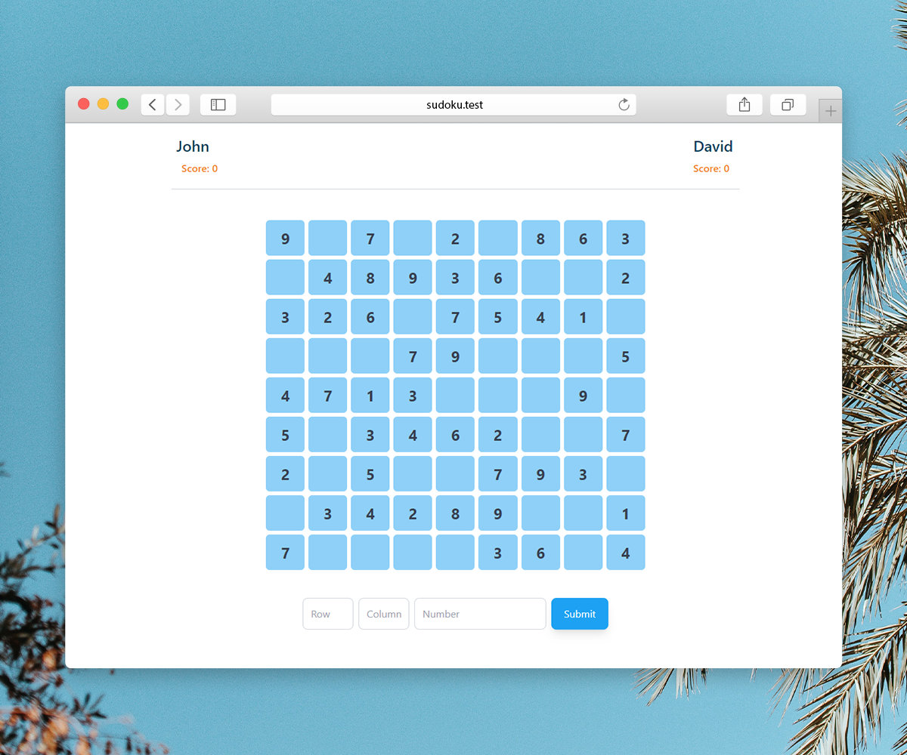

# Sudoku
An online Sudoku game that can be played by two players throughout the network



## Installation
Clone the repository.
```
git clone https://github.com/sadrahkm/Sudoku.git
cd Sudoku
```
Install npm packages.
```
npm install
```
It's done! You can [visit the game](http://127.0.0.1:3000/) on port 3000 of you localhost.
Also, the other player can join you on the same port.